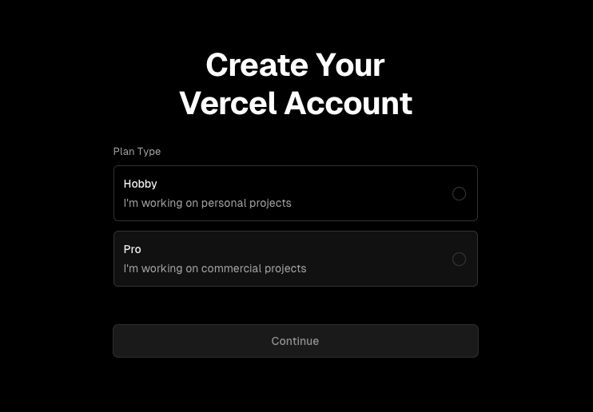
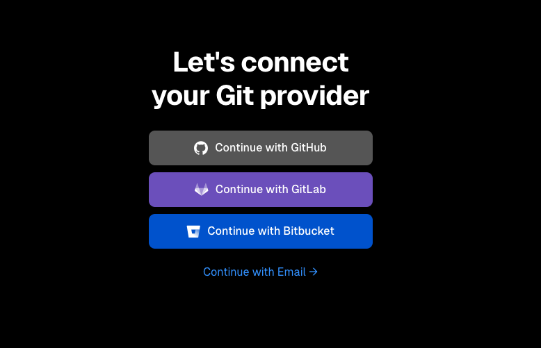
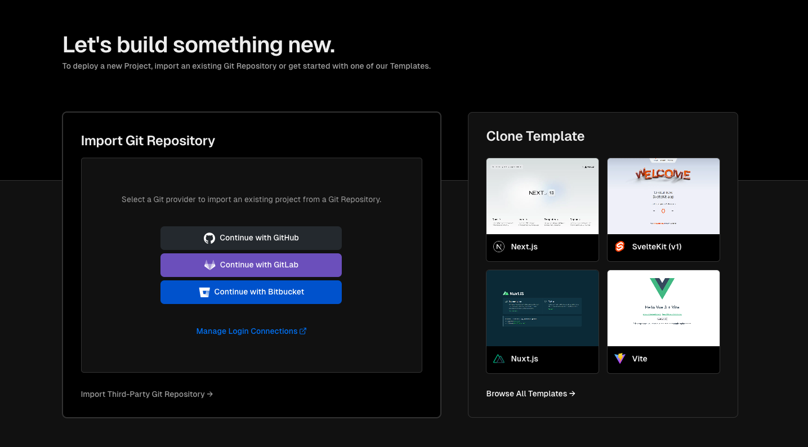
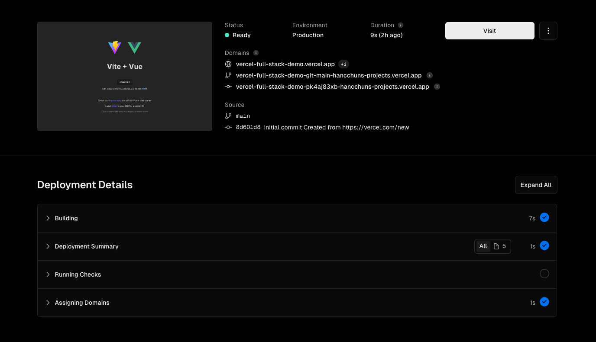
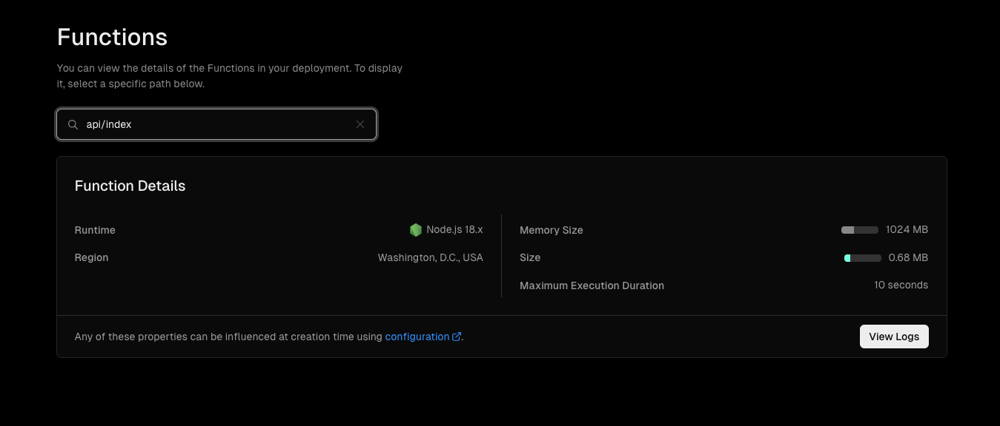
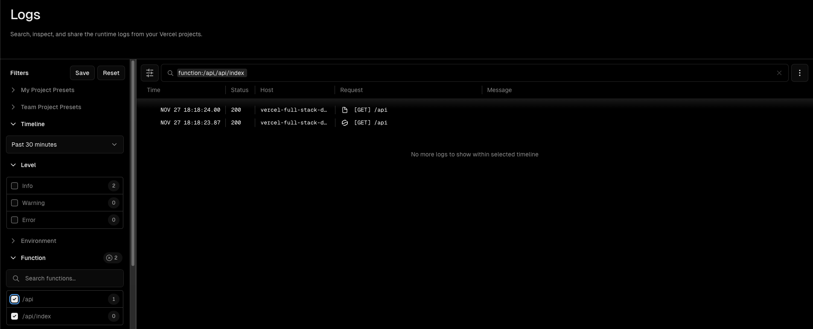
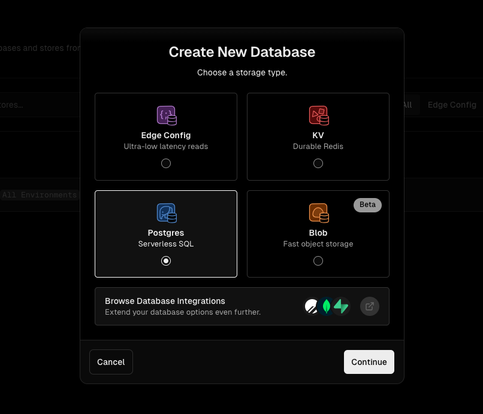
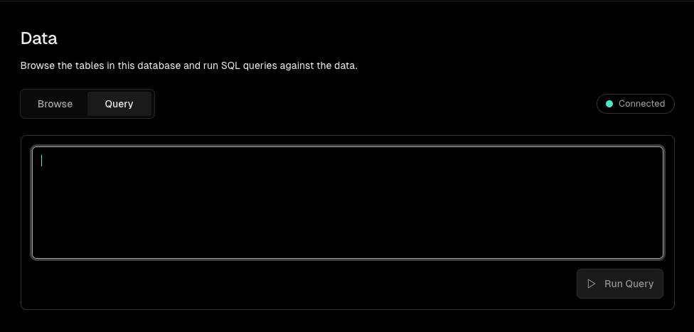
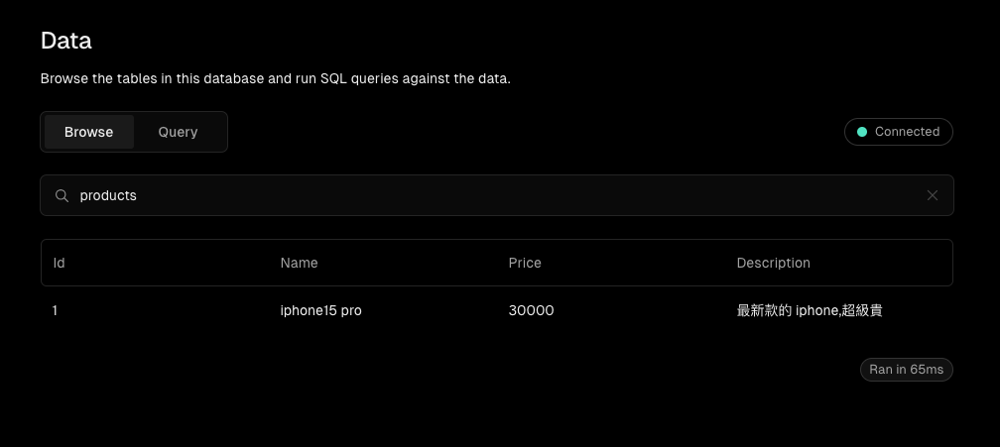

# vercel 上線最速傳說 - serverless fullstack web site

## 我們的目標產出
1. 一個在前後端分離的環境下，有現代前端框架與 serverless 後端運算 data base 的網站。
2. 在 github 開好 repo 並實作 CD，部署到公開網域。
3. 10 分鐘內搞定


## 事前準備
https://vercel.com/ 註冊帳號



記得連結 github 帳號



## 建立 vercel 專案

當我們要建立一個 vercel 專案時，可以直接選擇要部署的 git repo，或是從 template 選擇一個範例專案來建立。



如果是從 template 選擇範例專案來建立，也可以同步新建立 repo 到 git provider 上。  

等候部署完成後，就可以看到部署完成的網址了。目前為止，我們已經完成了一個靜態網站的部署。



## 加入 serverless function

在 vercel 上，我們可以透過 serverless function 來處理一些後端運算的需求，例如：api、cron job、webhook 等等。

在 `api/index.js` 下，我們可以寫入一些 serverless function 的程式碼，部署後就可以透過 `https://<your-domain>/api` 來呼叫這個 function。

```js
const app = require("express")();

app.get("/api", (req, res) => {
  res.json({ message: "Hello from the API!" });
});

module.exports = app;
```

::: tip
如果你是 clone template 專案來建立的，記得要檢查 package.json 裡面的 module 的 type 設定（commonjs or esm）
:::

好了之後可以在 Functions 頁面看到我們剛剛新增的 function


接著去 `https://<your-domain>/api` 看看有沒有成功呼叫到 function，之後可以從 log 看到 function 的執行紀錄。



## 建立資料庫

在 project 的設定頁面，可以看到有一個 Database 的選項，在這裡新建立 postgres 的 database。



建立完成之後馬上建立一個 table，並且新增一些資料。


``` sql
CREATE TABLE products (
  "id" SERIAL,
  "name" varchar(255) NOT NULL,
  "price" integer NOT NULL,
  "description" varchar(255) NOT NULL,
  PRIMARY KEY ("id")
);
```

``` sql
INSERT INTO products ("name", "price", "description") VALUES ('iphone15 pro', 30000, '最新款的 iphone，超級貴');
```



## api 串接資料庫

vercel 幫我們處理好 database 的連線，只需要透過 vercel CLI 將 repo 與 vercel project 連結起來，就可以在 serverless function 中使用 database 了。

### 安裝 vercel CLI

```bash
yarn global add vercel
```

### 連結 vercel project

```bash
vercel link

Vercel CLI 32.5.6
? Set up “~/{your-project-path}”? [Y/n] y
? Which scope should contain your project? {vercel-project-scope}
? Found project “{vercel-project-scope/vercel-project-name}”. Link to it? [Y/n] y
✅  Linked to {vercel-project-scope/vercel-project-name} (created .vercel and added it to .gitignore)
```

這樣就完成了 vercel project 與 repo 的連結，vercel 會幫我們處理 database 的連線。  

接著使用 @vercel/postgres 來連線 database，並且寫入一個 serverless function 來取得資料庫的資料。

```bash
yarn add @vercel/postgres
```

```js
const app = require("express")();
const { sql } = require("@vercel/postgres");

app.get("/api/products", async (req, res) => {
  const products = await sql`SELECT * FROM products`
  res.json(products);
});

module.exports = app;
```

最後很重要的要增加路由設定，讓 vercel 知道要將 `/api` 的路由導到哪個 function。

```json | vercel.json
{
  "rewrites": [
    {
      "source": "/api/(.*)",
      "destination": "/api"
    }
  ]
}
```

## 完成 serverless fullstack web site ! 

連線 `https://<your-domain>/api/products` 看看有沒有成功取得資料庫的資料。
```json
{
    "command": "SELECT",
    "fields": [
        {
            "columnID": 1,
            "dataTypeID": 23,
            "dataTypeModifier": -1,
            "dataTypeSize": 4,
            "format": "text",
            "name": "id",
            "tableID": 40961
        },
        {
            "columnID": 2,
            "dataTypeID": 1043,
            "dataTypeModifier": 259,
            "dataTypeSize": -1,
            "format": "text",
            "name": "name",
            "tableID": 40961
        },
        {
            "columnID": 3,
            "dataTypeID": 23,
            "dataTypeModifier": -1,
            "dataTypeSize": 4,
            "format": "text",
            "name": "price",
            "tableID": 40961
        },
        {
            "columnID": 4,
            "dataTypeID": 1043,
            "dataTypeModifier": 259,
            "dataTypeSize": -1,
            "format": "text",
            "name": "description",
            "tableID": 40961
        }
    ],
    "rowAsArray": false,
    "rowCount": 1,
    "rows": [
        {
            "id": 1,
            "name": "iphone15 pro",
            "price": 30000,
            "description": "最新款的 iphone，超級貴"
        }
    ],
    "viaNeonFetch": true
}
```

## vercel 與 aws 的比較

vercel 已經把大部分的事情都幫我們處理好了，我們只需要專注在開發上。如果只是要建立一個簡單的網站，vercel 是一個很好的選擇。

aws 的優勢在於他的彈性，可以針對不同的需求來選擇不同的服務，例如：EC2、ECS、Lambda、RDS、DynamoDB 等等，但是這也意味著我們需要花更多的時間來設定服務。

對前端工程師做 side project 或是做後端或是DB操作的練習，vercel 是一個免費快速的選擇。


